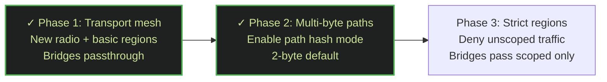

# Current settings

## Radio Parameters

All nodes in the mesh must be configured with identical radio settings. Mismatched parameters will prevent communication.

| Parameter        | Value       |
|------------------|-------------|
| Frequency        | 869.431 MHz |
| Bandwidth        | 62.5 kHz    |
| Spreading Factor | SF6         |
| Coding Rate      | CR5         |

## Regional Settings

At this moment, regions are recommended, especially for use inside Crucible, where all repeater are properly configured. Due to the low number of repeaters with regions in the main mesh, to get messages out of crucible unfortunately you may need to disable region scope.

> All repeaters must have regions configured before joining the mesh. See Phase 1 for settings.

## Bridges

The Crucible mesh has a number of bridges that connect it to the main mesh so that message exchange is possible.

# Roadmap



## Phase 1: Transport mesh

In this phase the main goal is to switch to another frequency and SF/CR settings, to be able to start with a 'clean' new playfield for an alternative mesh.

Set Frequency:

```
set radio 869.431,62.5,6,5
```

As preparation for future filtering, we also want to start with the basic region settings, in this case we will start with:
- Country
- Province

Set Regions:

```
region put nl
region put PROVINCE
region allowf nl
region allowf PROVINCE
region save
```

Finally, we will set the default region of the repeater, which means that its adverts will be limited to this scope:
```
region default PROVINCE
```

The full list of available region identifiers can be found on [meshwiki.nl](https://meshwiki.nl/wiki/Lijst_van_regio%27s).

**Bridges:**
In this phase, the bridges will not filter any data going from/to the normal mesh. So basically it will be a passthrough back and forth between normal and crucible mesh.

**Showstopper:**
To be able to go back and forth between the 2 meshes, we need to disable some desired functionality. Otherwise the messages from the crucible mesh will not pass through the bridges and visa versa.

- Until the normal mesh has enough repeaters which are upgrade to at least firmware 1.14, we can not enable the new multi.hash settings
- Until the normal mesh has enough repeaters which have at least the 'nl' and 'province' regions configured, we can not enforce regions
- Until the firmware has fixed issues when `region denyf *` is set, we can not enfore regions (currently adverts, flood path discovery etc will break)


## Phase 2: Multi-byte path enabled

In this phase there are enough repeaters in both meshes with firmware 1.14+, so we are able to start using multi-byte paths.

On the repeater:
```
set path.hash.mode 1
```

On the companion:
- Setting scopes on the #channels
- Set the 'Default Path Hash Size' on 2-byte

## Phase 3: Strict regions enforced

In this phase regions should be configured on both meshes and used by most companions.

We are going to enforce regions by disabling the non scoped messages:

```
region denyf *
```

**Bridges:**
From this moment, the bridges will only allow traffic to pass if a scope is set on a message
